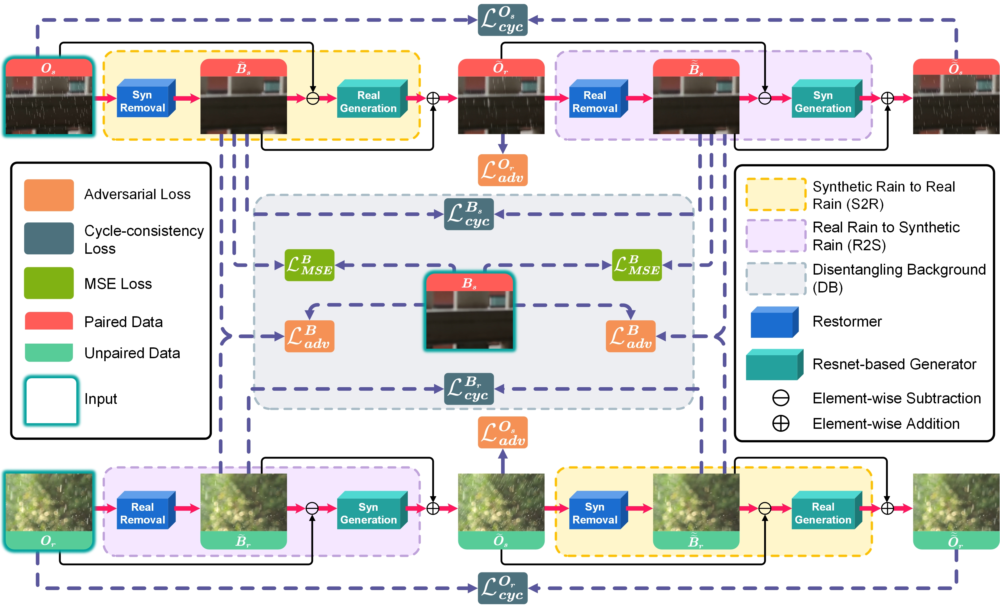

## DTT-Net: Dual-Domain Translation Transformer for Semi-Supervised Image Deraining

<p align="center"></p>

This repository provides the official PyTorch implementation of the following paper:
> **DTT-Net: Dual-Domain Translation Transformer for Semi-Supervised Image Deraining**<br> 
> Ze-Bin Chen, and Yuan-Gen Wang*   <br/>
> 
> **Abstract:** *Domain gap between synthetic and real rain has impeded advances in natural image deraining task. Existing methods are mostly built on convolutional neural networks (CNNs) and the receptive field of CNNs is limited, thereby resulting in poor domain adaptation. This paper designs a dual-domain translation Transformer network (termed DTT-Net) for semi-supervised image deraining. By leveraging Transformer architecture, the proposed DTT-Net can significantly mitigate the domain gap, greatly boosting the performance on real-world rainy images. Meanwhile, DTT-Net integrates three loss functions including adversarial, cycle-consistency, and MSE losses to adversarial training to further improve the visual quality of the derained images. Extensive experiments are conducted on synthetic and real-world rain datasets. Experimental results show that our DTT-Net outperforms the state-of-the-art by more than 2 dB PSNR..*

## Installation

This repository is built in PyTorch 1.10.2 and tested on Ubuntu 18.04 (Python3.6, CUDA11.2).
See [requirements.txt](requirements.txt) for the installation of dependencies required to run DTT-Net.


## Downloading datasets
To download the synthetic rainy `cityscape` / `SPA-Data` dataset:

**`Baidu Netdisk`**

https://pan.baidu.com/s/15kCnaN-V_PC2ht-Fh6Qk1Q?pwd=tzla 
extracting code：tzla

**`Google Drive`**

https://drive.google.com/drive/folders/1_rbz2KtesO2tZTbmrCRJAyFcEJHOSVV9?usp=sharing

The dataset should be saved into `./dataset/cityscape` directory.(or` ./dataset/SPA-Data `)

```bash
-train
  -Or
  -Os
  -Bs
-test
  -Or
  -Os
  -Bs
  -Br
```

## Training networks
To train / test DTT-Net on cityscape, run the training script below. 

```bash
# Train DTT-Net using the cityscape dataset
python train.py --dataroot ./dataset/cityscape --dataset_mode rain --model raincycle --name DTT-Net

# Test DTT-Net using the cityscape dataset
python test.py --dataroot ./dataset/cityscape --dataset_mode rain --model raincycle --name DTT-Net
```


To train / test DTT-Net on SPA-Data, run the training script below. 

```bash
# Train DTT-Net using the SPA-Data dataset
python train.py --dataroot ./dataset/SPA-Data --dataset_mode rain --model raincycle --name DTT-Net --n_epochs 90 --n_epochs_decay 90

# Test DTT-Net using the SPA-Data dataset
python test.py --dataroot ./dataset/SPA-Data --dataset_mode rain --model raincycle --name DTT-Net
```


## Using pre-trained networks

To download the pre-trained model checkpoint:

**`Baidu Netdisk`**

https://pan.baidu.com/s/15kCnaN-V_PC2ht-Fh6Qk1Q?pwd=tzla 
extracting code：tzla

**`Google Drive`**

https://drive.google.com/drive/folders/1_rbz2KtesO2tZTbmrCRJAyFcEJHOSVV9?usp=sharing

The pre-trained model checkpoint should be saved into `./checkpoints/DTT-Net` directory.

```bash
-checkpoints
  -DTT-Net
    -latest_net_D_B.pth
    -latest_net_D_Os.pth
    -latest_net_D_Ot.pth
    -latest_net_G1.pth
    -latest_net_G2.pth
    -latest_net_G3.pth
    -latest_net_G4.pth
```

## Citation
Our code is inspired by [Cycle GAN](https://github.com/junyanz/CycleGAN) and [JRGR](https://github.com/guyii54/JRGR).

## License

This source code is made available for research purpose only.
